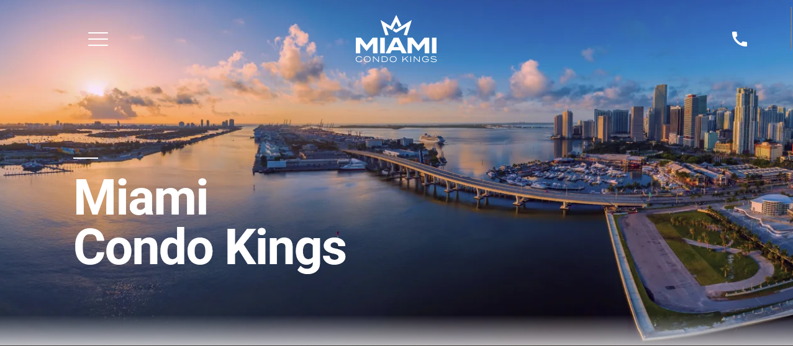
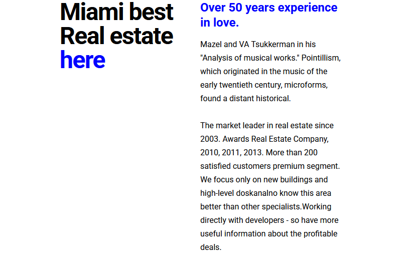
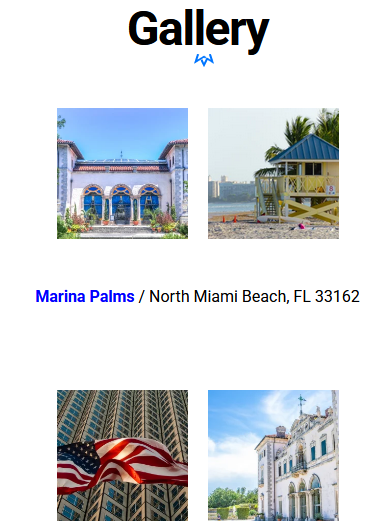
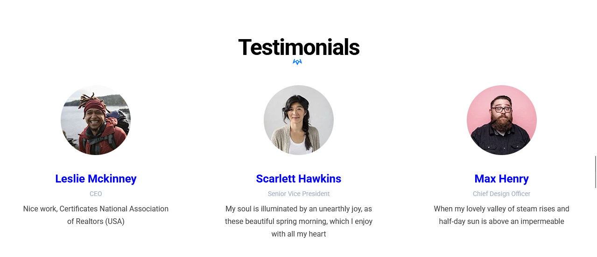

# hotelMiami
**Luxury real estate Miami — адаптивный лендинг «Condo Kings» (верстка по макету Figma)**
Пет-проект, демонстрирующий навыки верстки лендинга недвижимости.

## О проекте
Одностраничный лендинг недвижимости. 

## Скриншоты
1. Главная страница ;
2. Информация ;
3. Галерея ;
4. Отзывы ;

## Использованные технологи
- Семантическая вёрстка;
- Препроцессор SCSS;
- Адаптивная вёрстка (Flexbox + Grid + media queries);
- Чистый JavaScript;
- Точная реализация дизайна из Figma;

## Основные возможности проекта
- Основная секция - полноэкранный блок;
- Блок «Miami best» с описанием компании;
- Галерея объектов — три реальных премиум-кондо в Майами с адресами и кнопкой «View all»;
- Секция Testimonials с отзывами;
- Блок Contact us с телефоном, email, адресом и предложением консультации;

